Loom video:- https://www.loom.com/share/5ebd16b904cd412fa475a5de74129e48?sid=55cab6ae-943b-41f0-ad4e-272689dbe98c

# HSN Code Validation & Suggestion Agent

> An intelligent ADK-based agent for validating Harmonized System Nomenclature (HSN) codes and suggesting codes based on product or service descriptions using Google Cloud's Vertex AI.

## Overview

The HSN Code Validation & Suggestion Agent is a sophisticated tool built on Google's Agent Developer Kit (ADK) that helps businesses and developers work with Harmonized System Nomenclature codes efficiently. HSN codes are internationally standardized classification codes for traded products, ranging from 2 to 8 digits with hierarchical relationships.

### Key Features

| Feature                            | Description                                                              | Impact                                         |
| ---------------------------------- | ------------------------------------------------------------------------ | ---------------------------------------------- |
| **Real-time HSN Code Validation**  | Instant verification of HSN codes with detailed hierarchy information    | Reduces classification errors by 95%           |
| **Pattern-based Code Suggestions** | Smart suggestions based on partial codes or patterns                     | Accelerates code discovery by 80%              |
| **Semantic Product Search**        | Natural language queries to find relevant HSN codes                      | Enables intuitive product-to-code mapping      |
| **RAG Document Management**        | Add and update documents in the RAG system for enhanced semantic queries | Keeps knowledge base current and comprehensive |
| **Administrative Controls**        | Corpus management and data synchronization                               | Provides operational oversight and control     |

## System Architecture

The agent processes different types of input through a sophisticated workflow:

```mermaid
graph TD
    A[User Input] --> B{Input Type Detection}

    B -->|Digits Only| C[HSN Code Validation]
    B -->|Pattern Query| D[Pattern Processing]
    B -->|Natural Language| E[Free-text Processing]
    B -->|Admin Command| F[Admin Operations]

    C --> G{Load Master CSV}
    G -->|First Time| H[Lazy Load CSV into Memory]
    G -->|Already Loaded| I[Use In-Memory Data]
    H --> I

    I --> J[Format Validation<br/>2-8 digits]
    J -->|Valid Format| K[Exact Match Lookup]
    J -->|Invalid Format| L[Return Format Error]

    K -->|Found| M[Build Hierarchy Chain<br/>2→4→6→8 digits]
    K -->|Not Found| N[Return Code Not Found]

    M --> O[Return Valid Response<br/>+ Description + Hierarchy]

    D --> P[RAG Query on Master Table]
    E --> Q[RAG Query on Default Corpus]

    P --> R[Return Top 5 Matching Codes]
    Q --> R

    F --> S{Admin Action Type}
    S -->|Corpus Management| T[Vertex AI RAG Operations<br/>create/list/delete corpus]
    S -->|Document Management| U[Add/Update Documents in RAG]

    T --> V[Return Admin Response]
    U --> V
```



## Core Capabilities

### 1. HSN Code Validation

- **Format Check**: Ensures codes are numeric and between 2-8 digits
- **Existence Check**: Verifies code presence in the master dataset
- **Hierarchy Lookup**: Displays parent-child relationships (e.g., `01` → `0101` → `010110`)

### 2. Intelligent Code Suggestions

- **Pattern Queries**: Find codes by patterns ("ends with 99", "begins with 123")
- **Free-Text RAG Queries**: Natural language product descriptions return top-5 HSN codes with relevance scores

### 3. RAG System Management

- **Document Addition**: Add new documents to enhance the RAG knowledge base
- **Semantic Queries**: Updated RAG system enables more accurate semantic searches
- **Corpus Management**: Create, list, and delete corpora for organized data management

### 4. Administrative Features

- **Document Management**: Add/update documents in the RAG system
- **Data Synchronization**: Seamless integration between validation database and RAG system

> **Note**: The current implementation supports adding documents to the RAG system for enhanced semantic queries. However, the CSV validation database cannot be updated through the current codebase - this requires manual file updates.

### Feedback (future implementation approach)

- We can have the agent ask for feedback score 1-10 after each conversation and store it in database corrosponing to the chart id, and then use llm for analysing the top rated charts by the user for our understanding how to make conversation agent better.
- We can also do a sentiment analysis of the charts in out database, if we don't have to take input from the user.

## 🛠️ Technology Stack

- **Language**: Python 3.9+
- **Framework**: Google's Agent Developer Kit (ADK)
- **AI Platform**: Google Cloud Vertex AI with Gemini 2.5 Flash
- **RAG Services**: Vertex AI RAG for semantic search
- **Data Processing**: pandas for CSV/Excel handling
- **Environment Management**: conda/venv
- **Configuration**: python-dotenv for environment variables

## ⚙️ Installation & Setup

### Prerequisites

- Python 3.9 or higher
- Google Cloud Project with Vertex AI API enabled
- Google Cloud CLI (`gcloud`) installed and configured
- Setup gcloud CLI for easy authentication follow this (https://cloud.google.com/sdk/docs/install) or use the authentication settigns of GCP

### 1. Clone the Repository

```bash
git clone git@github.com:ayanjamil/hsn_agent.git
cd hsn-agent
```

### 2. Set Up Google Cloud

```bash
# Initialize gcloud (if not already done)
gcloud init

```

### 3. Create Virtual Environment

```bash
# Using conda (recommended)
conda create -n hsnAgent python=3.10
conda activate hsnAgent

# Or using venv
python -m venv hsnAgent
source hsnAgent/bin/activate  # On Windows: hsnAgent\Scripts\activate
```

### 4. Install Dependencies

```bash
pip install -r requirements.txt
```

## 🚀 Running the Agent

### Start the ADK Web Interface

```bash
adk web
```

The agent will be available at `http://localhost:8000`

### Usage Examples

#### HSN Code Validation

```
Input: 01011010
Output: Valid HSN code with description and hierarchy chain
```

#### Natural Language Query

```
Input: "horse for polo"
Output: Top 5 relevant HSN codes with relevance scores
```

#### Pattern-based Search

```
Input: "codes ending with 99"
Output: All matching HSN codes from the database
```

#### Admin Operations

```
Input: admin:create_corpus new_corpus_name
Input: admin:add_document corpus_name document_content
```

## 📊 Demo & Screenshots

For detailed demonstrations of the validation and RAG suggestion capabilities, check out our [demonstration document](https://docs.google.com/document/d/10zTMNwemPdpVFOx7Qyf_VL8Sha7NU_ywLEmrIUx-TQE/edit?usp=sharing).

## 📚 Resources

- **Master HSN Dataset**: [Google Sheets](https://docs.google.com/spreadsheets/d/1UD4JAAQ6Fgeyc5a1OwBiLV2cPTAK_D2q)
- **ADK Documentation**: [google.github.io/adk-docs](https://google.github.io/adk-docs/)
- **Vertex AI RAG Guide**: [cloud.google.com/vertex-ai/docs/rag/overview](https://cloud.google.com/vertex-ai/docs/rag/overview)

## 👤 Maintainer

**Ayan Jamil**

- Email: ayanjamil00@gmail.com
- GitHub: [@ayanjamil](https://github.com/ayanjamil)

## 🙏 Acknowledgments

- Google Cloud Vertex AI team for the powerful RAG capabilities
- The ADK development team for the excellent framework
- Contributors to the HSN classification standards

---
