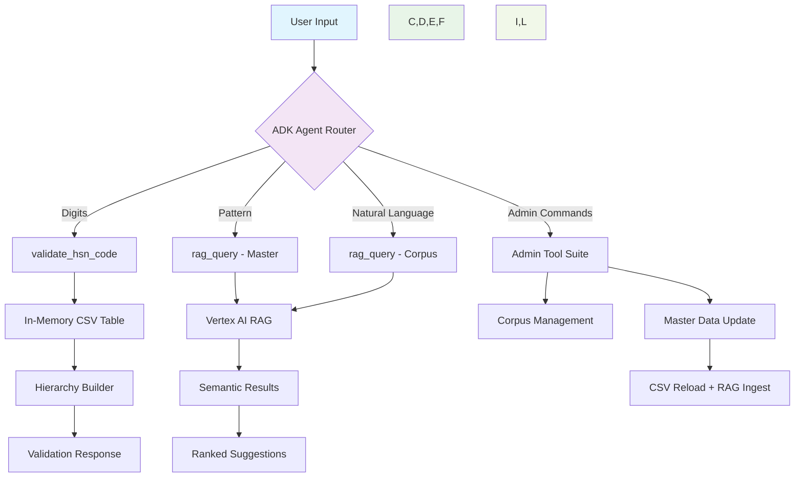

# Agent Design Document

## HSN Code Validation & Suggestion Agent

---

## Overall Architecture using ADK

The HSN Code Validation & Suggestion Agent is built on Google's **Agent Developer Kit (ADK)** framework, leveraging Vertex AI's capabilities for intelligent code validation and natural language processing. The architecture follows a **tool-based agent pattern** where the core ADK Agent orchestrates multiple specialized tools to handle different types of user requests.

## ADK Components Integration

### 1. **Agent Core (`Agent` class)**

- **Primary Component**: ADK's `Agent` class serves as the central orchestrator
- **LLM Integration**: Uses Vertex AI's Gemini models for natural language understanding
- **Tool Management**: Automatically routes user inputs to appropriate tools based on content analysis

### 2. **FunctionTool Suite**

The agent implements six specialized `FunctionTool` instances:

- `validate_hsn_code`: Core validation logic with hierarchy building
- `rag_query`: Semantic search using Vertex AI RAG
- `load_hsn_master`: Data loading and memory management
- `update_master`: Dynamic data updates with RAG re-ingestion
- Corpus management tools: `list_corpora`, `create_corpus`, `add_data`

### 3. **State Management**

- **Lazy Loading**: Master CSV loaded on first validation request
- **In-Memory Cache**: `tool_context.state["hsn_table"]` for O(1) lookups
- **Session Persistence**: Maintains loaded data across conversation turns

---

## User Input Processing Pipeline

### Input Classification Engine

The agent employs a **multi-stage input classification** system:

#### Stage 1: Format Detection

```
Input: "01011010"
├─ Contains digits? ✓
├─ Only digits? ✓ → HSN Code Validation
└─ Mixed content? → Further analysis
```

#### Stage 2: Intent Recognition

```
Input: "horse for polo"
├─ Pattern keywords? ("ends with", "contains") → Pattern Query
├─ Admin prefix? ("admin:") → Administrative Operation
└─ Natural language? → Free-text Search
```

#### Stage 3: Context-Aware Routing

- **Code Validation**: Direct CSV lookup with format validation (2-8 digits)
- **Pattern Matching**: RAG query against master table for structural searches
- **Semantic Search**: RAG query against curated corpus for conceptual matches
- **Admin Operations**: Corpus management and data maintenance

### Processing Workflows

#### HSN Code Validation Flow

1. **Format Validation**: Regex check for 2-8 digit pattern
2. **Existence Check**: Direct lookup in in-memory hash table
3. **Hierarchy Construction**: Build parent-child relationships (2→4→6→8 digits)
4. **Response Generation**: Structured output with validation status and hierarchy

#### Natural Language Processing Flow

1. **Query Preprocessing**: Clean and normalize user input
2. **RAG Invocation**: Vertex AI semantic search with configurable top_k
3. **Result Ranking**: Score-based relevance ranking
4. **Response Formatting**: Structured list with codes, descriptions, and confidence scores

---

## Output Handling Strategy

### Response Format Standardization

The agent generates **contextually appropriate responses** based on query type:

#### Validation Responses

```
✅ Valid Code Response:
"The HSN code **01011010** is valid: PURE-BRED HORSES FOR BREEDING.
Hierarchy:
• 01 → LIVE ANIMALS
• 0101 → LIVE HORSES, ASSES, MULES AND HINNIES
• 01011010 → PURE-BRED HORSES FOR BREEDING"

❌ Invalid Code Response:
"Code `123`: ❌ invalid format (must be 2–8 digits)."
```

#### Suggestion Responses

```
🔍 Pattern Match Response:
"I found these codes that end with '90':
1. 01012990 – Other horses (Score: 0.95)
2. 01022990 – Other bovine animals (Score: 0.87)"

💡 Semantic Search Response:
"Top HSN code suggestions for 'horse for polo':
1. 01012910 – Horses for riding (Score: 0.92)
2. 01011010 – Pure-bred horses (Score: 0.88)"
```

---

## System Architecture Diagram



---

## Performance & Scalability Considerations

### Optimization Strategies

- **Lazy Loading**: Master CSV loaded only when needed
- **In-Memory Caching**: O(1) lookup performance for validation
- **RAG Chunking**: Optimized document segmentation for semantic search
- **Batch Processing**: Efficient corpus updates for large datasets

### Scalability Features

- **Stateless Tool Design**: Easy horizontal scaling
- **Configurable Parameters**: Adjustable top_k, chunk_size, similarity thresholds
- **Modular Architecture**: Independent tool scaling and deployment
